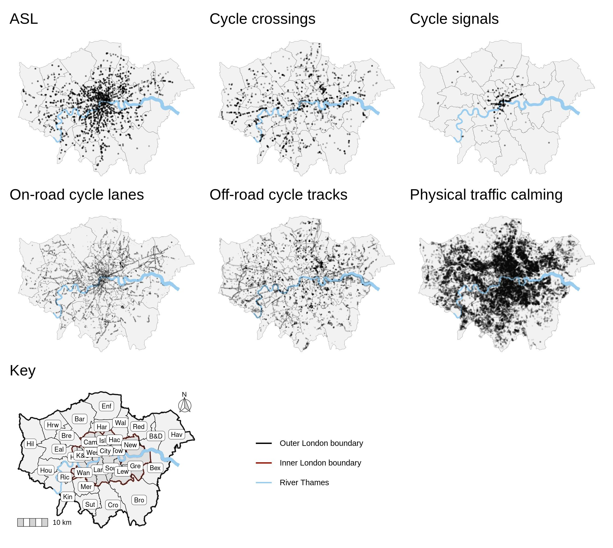
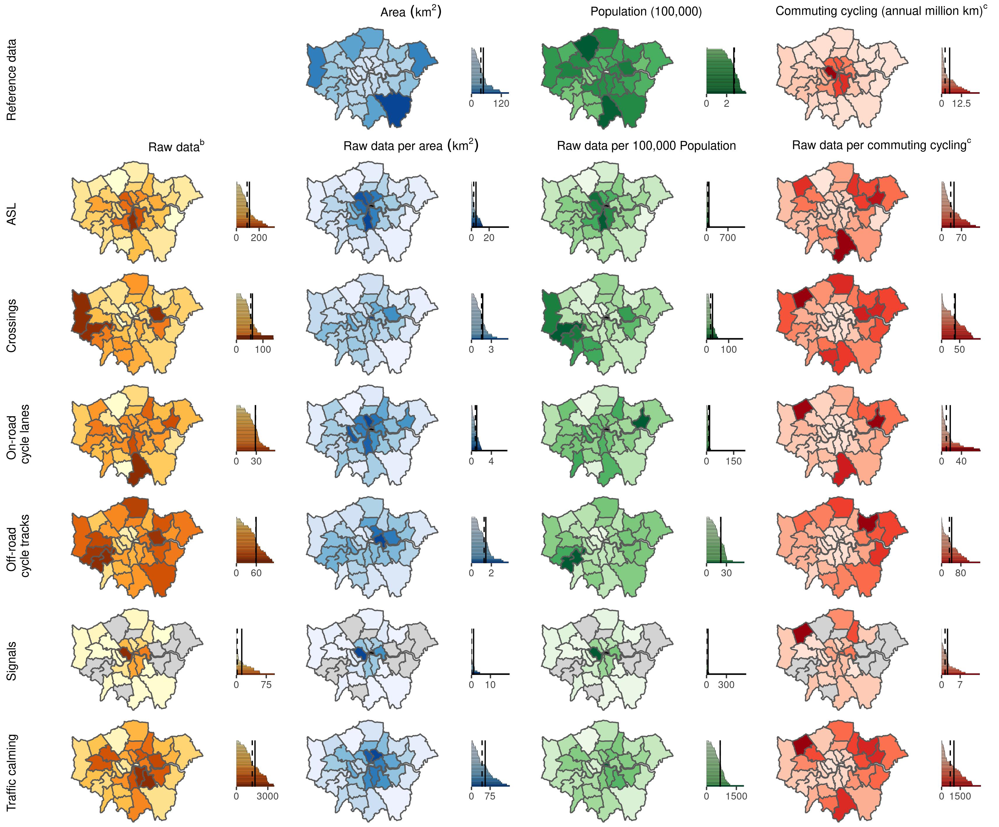
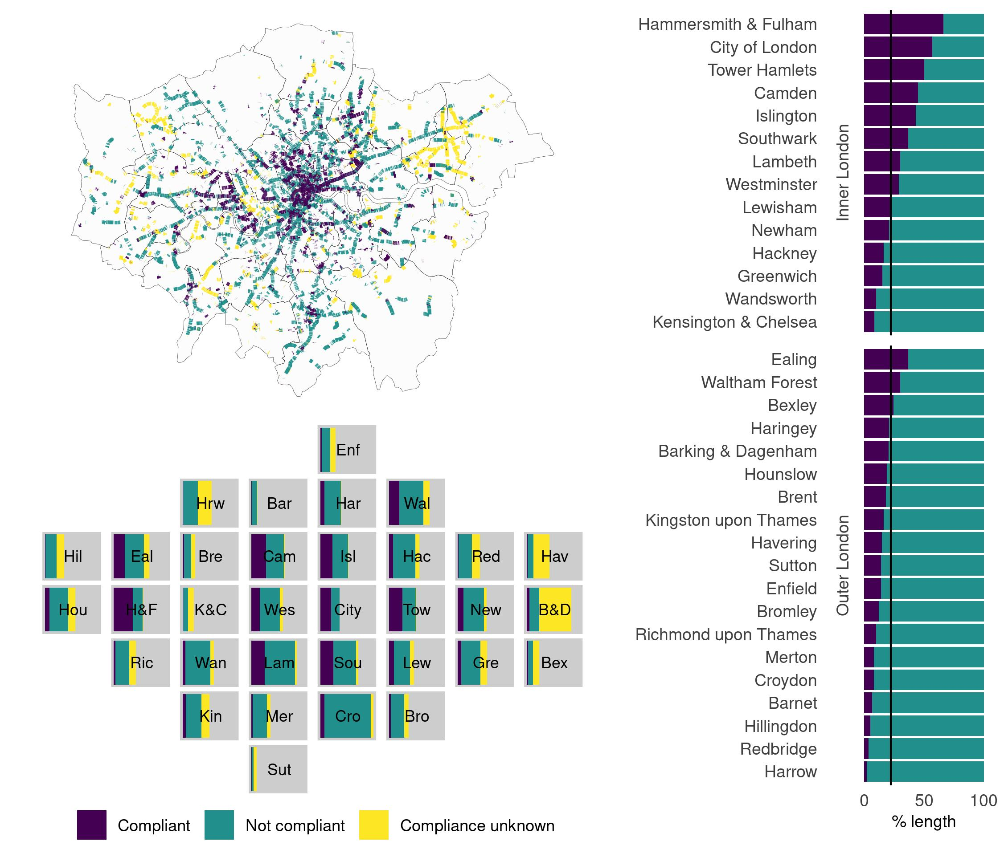

# Is cycling infrastructure in London safe and equitable? Evidence from the Cycling Infrastructure Database.

This repository contains the code used to clean the data for this paper and to generate the visualisations.  
LINK TO PAPER

## CID data cleaning code 
The below files show the data cleaning process for each of the 9 CID datasets.  The data cleansed files can be found in the data subfolder.   

[data_clean_CID_asl.R](code/data_clean_CID_asl.R) - data cleaning file for Advanced Stop Lines  

[data_clean_CID_crossings.R](code/data_clean_CID_crossings.R) - data cleaning file for cycle crossings  

[data_clean_CID_cyclelanestracks.R](code/data_clean_CID_cyclelanetracks.R) - data cleaning file for cycle lanes and tracks  

[data_clean_CID_parking.R](code/data_clean_CID_parking.R) - data cleaning file for cycle parking  

[data_clean_CID_restrictedpoints.R](code/data_clean_CID_restrictedpoints.R) - data cleaning file for restricted points  

[data_clean_CID_restrictedroutes.R](code/data_clean_CID_restrictedroutes.R) - data cleaning file for restricted routes  

[data_clean_CID_signage.R](code/data_clean_CID_signage.R) - data cleaning file for signage  

[data_clean_CID_signals.R](code/data_clean_CID_signals.R) - data cleaning file for cycle signals  

[data_clean_CID_trafficcalming.R](code/data_clean_CID_trafficcalming.R) - data cleaning file for traffic calming

## Obtaining and cleaning other datasets used in the analysis  
This [code](code/get_pct_km_cycled.R) gets the estimated about of commuting cycling through each borough using the Propensity to Cycle Tool (based on the 2011 Census). The code used to manipulate and join OpenStreetMap data to the cycle lanes is in the code for Figure 6 below.    
  
## Summarised data
These two R files contain the code used to generate summaries of the data including the tables generated in the paper.  
[data_analysis_summary_stats_part3.R](code/data_analysis_summary_stats_part3.R)  
[data_analysis_summary_stats_part2.R](code/data_analysis_summary_stats_part2.R)
    
## Visualisation code  

#### Visualisations in Table 1 and Figure 3
This [code](code/visualise_characteristics.R) creates bar charts and density plots for the characteristics of the different types of safety-related infrastructure that were used in  table 1 and figure 3. 

#### Figure 4
This [code](code/visualise_all_assets.R) generates the map of infrastructure most relevent for safety in the CID (figure 4) shown below.
##### Figure 4: Spatial distribution of cycling infrastructure across London

#### Figure 5
The complex chloropleths and bar charts in Figure 5 were all generated individually in ggplot and then joined using cowplot using this
[code](code/visualise_borough_chloropleths.R).
##### Figure 5: Visualisations of CID borough-level cycling infrastructure as raw data and normalised to borough geographical area, population size and commuter cycling (bar chart key:dashed line = median, solid line = mean) 

#### Figures 6 and 7
The code for Figures 6 and 7 utilised London squared data which is available at https://github.com/aftertheflood/londonsquared/blob/master/site/data/grid.csv with more information at https://tools.aftertheflood.com/londonsquared/design-process (accessed 5.10.21).

This [code](code/visualise_cyclelanes.R) manipulates the data to create the visualisation and contains the code used to make the actual visualisations for Figure 6.
##### Figure 6: Highest degree of separation of CID on-road cycle lanes from motor vehicles: Spatial distribution (left) and spatially arranged borough bar charts showing length in kilometre (top right) and length by borough area in kilometre per square kilometre (bottom right)
 

Whilst this [code](code/visualise_LTN1_20_compliance.R) manipulates the OpenStreetMap data and the cycle lanes data to estimate and visualise compliance with the UK Design Standards (Figure 7).  Not all the data used in this code is in the data folder because of the size of the datasets.  However, if you run the code it should be reproducible.  The OSM Greater London data file for January 2019 OSM data was sourced from Geofabrik (greater-london-190101.os.pbf; https://download.geofabrik.de/europe/great-9britain/england/greater-london.html).

##### Figure 7: Estimated compliance of CID on-road cycle lanes with LTN 1/20: Spatial distribution (top left), spatially arranged borough bar charts showing length in kilometre (bottom left) and percentage of length by borough where speed limit is known (right, solid line = mean)

  
  

## Acknowledgements and Licenses
After the flood: Copyright 2019 After the Flood Ltd.  
TfL data: Powered by TfLOpen Data.  Contains OS data © Crown copyright and database rights 2016 and Geomni UK Map data © and database rights [2019].  
ONS data: Contains public sector information licensed under the Open Government Licence v3.0.  
OpenStreetMap data: Map data copyrighted OpenStreetMap contributors and available https://www.openstreetmap.org and contains Ordnance Survey data © Crown copyright and database right 2010-19.

