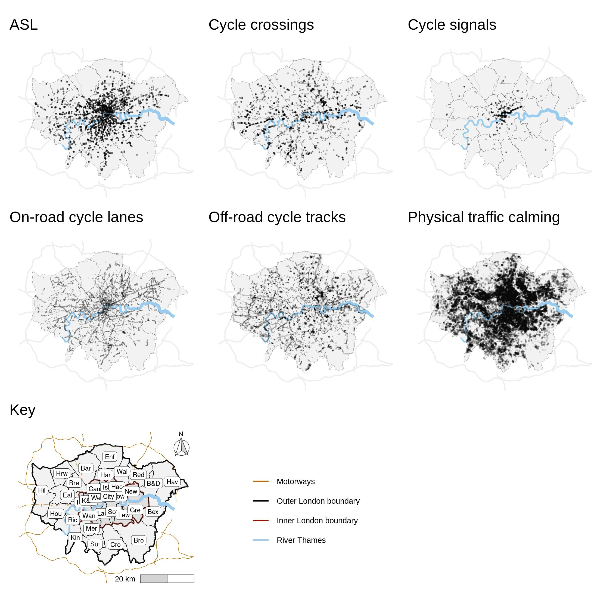
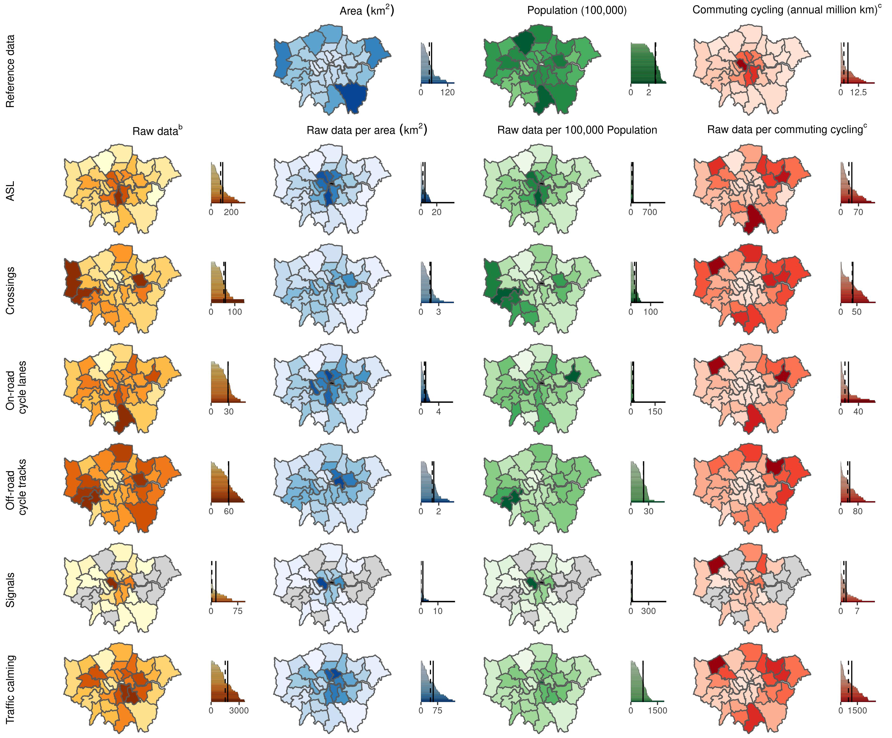
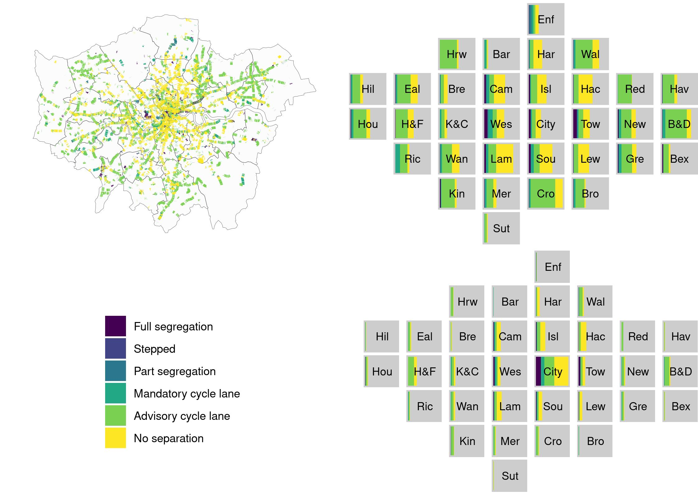

# Is cycling infrastructure in London safe and equitable? Evidence from the Cycling Infrastructure Database.

LINK TO PAPER

## CID Data Cleaning code 
The below files show the data cleaning process for each of the 9 CID datasets.  The data cleansed files can be found in the data subfolder.   

[data_clean_CID_asl.R](data_clean_CID_asl.R) - data cleaning file for Advanced Stop Lines  

[data_clean_CID_crossings.R](data_clean_CID_crossings.R) - data cleaning file for cycle crossings  

[data_clean_CID_cyclelanestracks.R](data_clean_CID_cyclelanetracks.R) - data cleaning file for cycle lanes and tracks  

[data_clean_CID_parking.R](data_clean_CID_parking.R) - data cleaning file for cycle parking  

[data_clean_CID_restrictedpoints.R](data_clean_CID_restrictedpoints.R) - data cleaning file for restricted points  

[data_clean_CID_restrictedroutes.R](data_clean_CID_restrictedroutes.R) - data cleaning file for restricted routes  

[data_clean_CID_signage.R](data_clean_CID_signage.R) - data cleaning file for signage  

[data_clean_CID_signals.R](data_clean_CID_signals.R) - data cleaning file for cycle signals  

[data_clean_CID_trafficcalming.R](data_clean_CID_trafficcalming.R) - data cleaning file for traffic calming

## Obtaining and cleaning other datasets used in the analysis  
This code gets the estimated about of commuting cycling through each borough using the Propensity to Cycle Tool (based on the 2011 Census): [get_pct_km_cycled.R](get_pct_km_cycled.R)  
  
## Visualisation code  
This code creates bar charts and density plots for the characteristics of the different types of safety-related infrastructure that were used in  table 1 and figure 2:
[visualise_characteristics.R](visualise_characteristics.R) 

This code generates the map of the safety-related infrastructure in the CID (figure 3): [visualise_all_assets.R](visualise_all_assets.R) 
#### Figure 3

The complex chloropleths and bar charts in Figure 4 were all generated individually in ggplot and then joined using cowplot:
[visualise_borough_chloropleths.R](visualise_borough_chloroplets.R)
#### Figure 4

The code for Figures 5 and 6 utilised London squared data which is available at https://github.com/aftertheflood/londonsquared/blob/master/site/data/grid.csv with more information at https://tools.aftertheflood.com/londonsquared/design-process (accessed 5.10.21)

#### Figures 5 and 6
 

### Acknowledgementsand Licenses
After the flood: Copyright 2019 After the Flood Ltd.  
TfL data: Powered by TfLOpen Data.  Contains OS data © Crown copyright and database rights 2016 and Geomni UK Map data © and database rights [2019].  
ONS data: Contains public sector information licensed under the Open Government Licence v3.0.  
OpenStreetMap data: Map data copyrighted OpenStreetMap contributors and available https://www.openstreetmap.org and contains Ordnance Survey data © Crown copyright and database right 2010-19.

